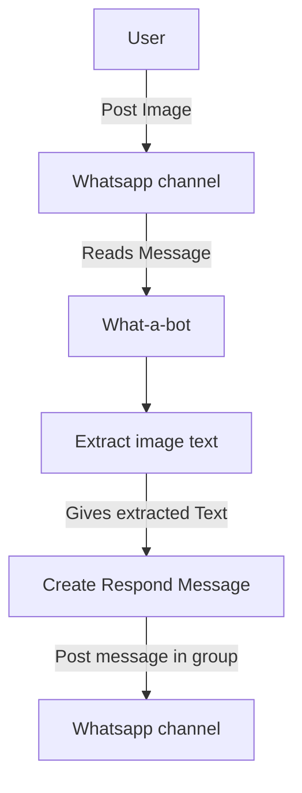
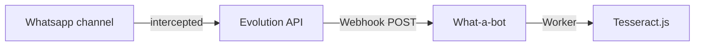
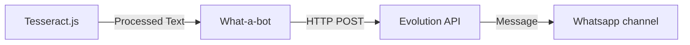

# What-a-Bot

A **Whatsapp** bot that extracts text from images.

## Core idea:

Data flow diagrams:



Getting the message



Posting the Message



## Dependencies:

- Node
- pnpm
- [ evolution-api ](https://github.com/evolution-foundation/evolution-api): to receive and send messages.
- [ tesseract.js ](https://github.com/naptha/tesseract.js): to extract text from images.

## Running:

1. Build the project.

```bash
pnpm build
```

2. Set up **.env** file.

```bash
cat << EOF > .env
JID_WHITELIST=...@s.whatsapp.net
# This variable controls which channels the bot will listen, you can add but make sure to write a comma to separate each entry
EVO_AUTHENTICATION_API_KEY=your_api_key
PORT=3000
# The port in which the backend will listen
EVO_DOMAIN=http://what-a-bot-evolution:8080
EVO_INSTANCE_NAME=what-a-bot
# Must be the same name given to your instance
LOG_JID=
# Optional, its only used to test backend's health
EOF
```

3. Launch containers:

```bash
docker compose up -d
```

4. Set up your **Evolution API** instance
   1. In your web browser go to [http://localhost:8080/manager/](http://localhost:8080/manager/) or the `manager` page of your custom domain for **Evolution API**.
   2. Click `Instance +` and fill the data. Remember to select `Evolution` under `Channel` option.
   3. Select the config button for your new instance then go to Events > Webhook.
   4. Press `Enabled`, `Webhook by Events`, `Webhook Base64` and below **Events** `MESSAGES_UPSERT`, for the `URL` type `http://what-a-bot-backend:3000/webhook` or your custom backend domain.

### OPTIONAL:

To check if everything is correct you can run the following:

```bash
BACKEND_DOMAIN=http://localhost:3000 # example
curl $BACKEND_DOMAIN/health
# {"data":{"instance":{"instanceName":"what-a-bot","state":"open"}},"status":200,"message":"Log sent to whatsapp"}
#                                                                                           ^ Only if LOG_JID is defined
```

However, this doesnt check if the instance has `MESSAGES_UPSERT` event enabled.

## Developing:

1. Make sure to have installed both `node` and `pnpm`.
2. Run:

```bash
docker compose --file docker-compose.override.yaml up -d
```

3. Set up your **Evolution API** instance.
4. Enjoy coding! :D

## GOALS:

- [ ] Check for necessary events inside `/health` endpoint.
- [ ] Improve type safety like sanitizing received data from endpoints (i.e checking if its a valid Base64 string) and improve error handling (theres a lot of uncatched Promises).
- [ ] Add proper logging.
- [x] Create a `dev` container with hot reloading.
- [ ] Create a message queue to feed multiple tesseract's workers in order to work with multiple messages.
